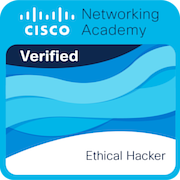

## Olá! Eu sou o Igor 

Estudante de Engenharia de Software pelo Inatel, apaixonado por tecnologia, desenvolvimento de software e cibersegurança. Sempre buscando aprender novas ferramentas e explorar o universo do hacking ético.     
<div align="center">
+Initializing...;>+Focus:+Cybersecurity+%26+Hacking;>+Software+Engineering+Student" alt="Typing SVG" />
</div>

### $ whoami

```json
{
  "nome": "Igor",
  "formacao": "Engenharia de Software - Inatel",
  "specializacao": "Java",
  "toolkit": ["Python", "C++", "HTML"],
  "foco": ["Cibersegurança", "Hacking Ético"]
}
```

### 🛠️ Tecnologias & Ferramentas


### 🏆 Certificações

<div align="left">
  <a href="https://www.credly.com/badges/5f0cc205-9980-40cf-a92a-bcd4bce4658d/public_url" target="_blank">
    
  </a>
</div>

### 🌟 Repositórios em Destaque

- [-machine](https://github.com/Sanak3/-machine)
- [Cods_Digispark](https://github.com/Sanak3/Cods_Digispark)
- [Data_Scraper---I.S](https://github.com/Sanak3/Data_Scraper---I.S)
- [c14-atividade](https://github.com/Sanak3/c14-atividade)


### 📫 Contato

Se quiser trocar ideia sobre tecnologia, projetos ou cibersegurança, fique à vontade para conectar!

[](https://github.com/Sanak3)

[](https://www.linkedin.com/in/igor-araujo-f/)


> "É tempo ruim o tempo todo" 🥋


